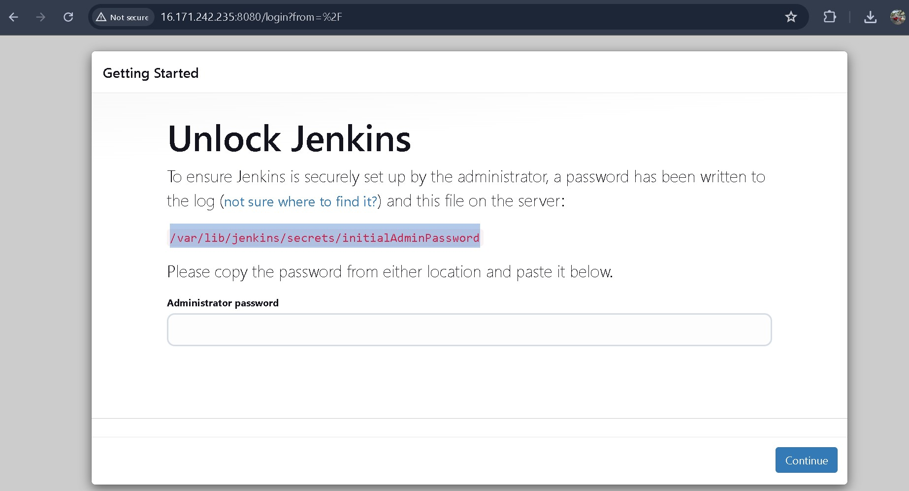
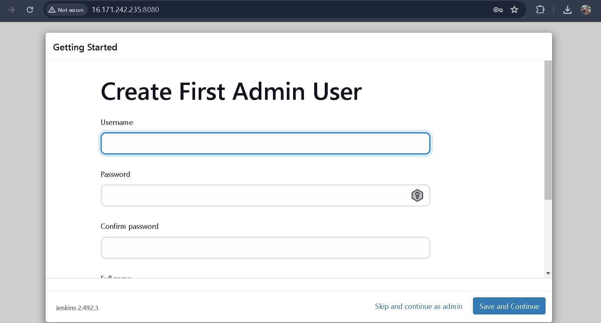

# Jenkins Deployment on EC2 for CI/CD

This project demonstrates how to deploy **Jenkins** on an **EC2 instance** running **Ubuntu** for automating application deployment through a **CI/CD pipeline**.

## Steps Involved:

1. **EC2 Setup:**
   - Launched an EC2 instance on AWS (Ubuntu).
   - Created an SSH key pair for secure access.

2. **Package Updates & Java Installation:**
   - Updated system packages and installed Java to meet Jenkins' requirements.

3. **Jenkins Installation:**
   - Installed Jenkins and configured it to run as a service.

     

4. **Firewall Configuration:**
   - Configured AWS Security Groups to open port 8080 for Jenkins web access.

5. **Deployment:**
   - Used Jenkins to deploy an application, automating the deployment process.

     

## Technologies Used:

- AWS EC2
- Jenkins
- Java
- AWS Security Groups

## Outcome:

Successfully deployed Jenkins and configured it for automating app deployments, providing a foundation for continuous integration and delivery (CI/CD).

## License:

MIT License

