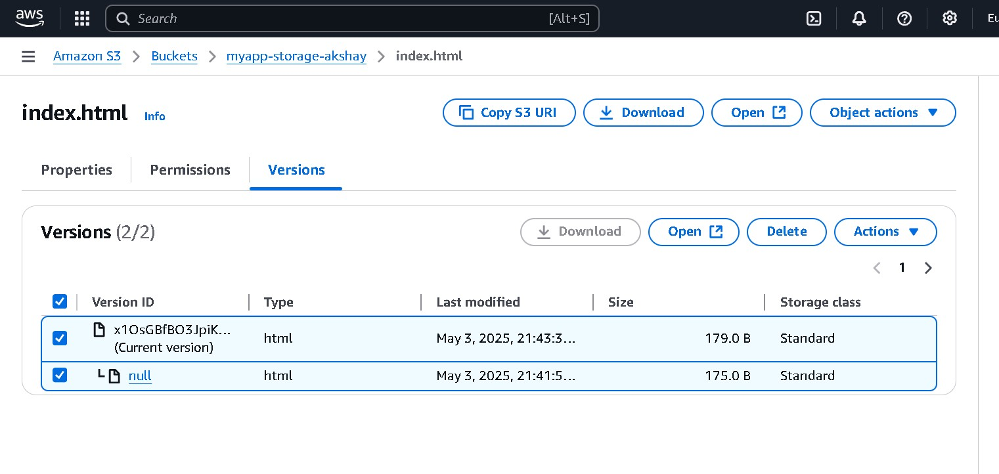
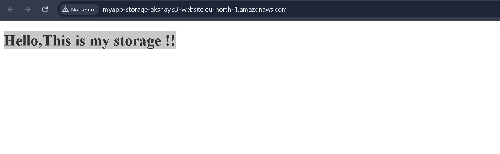

# AWS S3
## About

### What is Amazon S3?
Simple Storage Service is a scalable and secure cloud storage service provided by Amazon Web Services (AWS). 
It allows you to store and retrieve any amount of data from anywhere on the web.

### What are S3 buckets?
S3 buckets are containers for storing objects (files) in Amazon S3. 
Each bucket has a unique name globally across all of AWS. You can think of an S3 bucket as a top-level folder that holds your data

### Characteristics

Durability and availability: S3 provides high durability and availability for your data.
Scalability: You can store and retrieve any amount of data without worrying about capacity constraints.
Security: S3 offers multiple security features such as encryption, access control, and audit logging.
Performance: S3 is designed to deliver high performance for data retrieval and storage operations.
Cost-effective: S3 offers cost-effective storage options and pricing models based on your usage patterns.

# 🌐 AWS S3 Static Website Hosting Project

## 🗂️ Project Overview

In this project, we explored the use of **Amazon S3** (Simple Storage Service) to host a static website. Key tasks included creating an S3 bucket, managing permissions, enabling versioning, and configuring static website hosting.

---

## ✅ Steps Performed

### 1. **Created an S3 Bucket**
- Created a new S3 bucket via the AWS Console.
- Used a globally unique bucket name.
  
 
  


### 2. **Uploaded an HTML File**
- Uploaded a simple `index.html` file as the homepage for the website.

### 3. **Enabled Versioning**
- Enabled **versioning** to preserve, retrieve, and restore every version of the uploaded objects.

### 4. **Tested with IAM Users**
- Created different **IAM users** with different permission levels.
- Verified access behavior based on IAM policies.

### 5. **Applied Bucket Policies**

#### 🔐 Restrict Access to IAM Users Only

```json
{
  "Version": "2012-10-17",
  "Id": "RestrictBucketToIAMUsersOnly",
  "Statement": [
    {
      "Sid": "AllowOwnerOnlyAccess",
      "Effect": "Deny",
      "Principal": "*",
      "Action": "s3:*",
      "Resource": [
        "arn:aws:s3:::your-bucket-name/*",
        "arn:aws:s3:::your-bucket-name"
      ],
      "Condition": {
        "StringNotEquals": {
          "aws:PrincipalArn": "arn:aws:iam::AWS_ACCOUNT_ID:root"
        }
      }
    }
  ]
}

```
Explanation:
This denies access to everyone except the root user of your AWS account. It ensures only IAM users under your account can access the bucket.


### 🌐 Public Read Bucket Policy for Website Access

```json
{
  "Version": "2012-10-17",
  "Statement": [
    {
      "Sid": "PublicReadGetObject",
      "Effect": "Allow",
      "Principal": "*",
      "Action": [
        "s3:GetObject"
      ],
      "Resource": [
        "arn:aws:s3:::<Bucket-Name>/*"
      ]
    }
  ]
}
```
Explanation:
This allows anyone on the internet to view your files — required to make the website publicly accessible.
Only use this if your content is intended to be public.

# ✅ Final Result
## Static website hosted and accessible via the S3 website URL.

## Versioning and IAM access worked as expected.

## Bucket security tested using IAM policies and public access settings.
## We disabled Block public access (bucket settings) .


