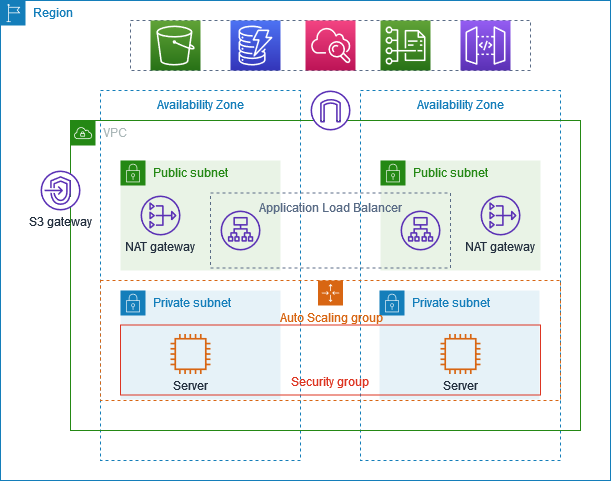
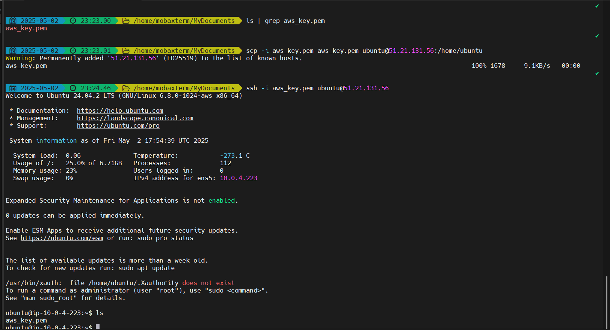
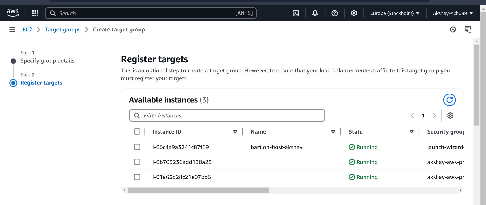
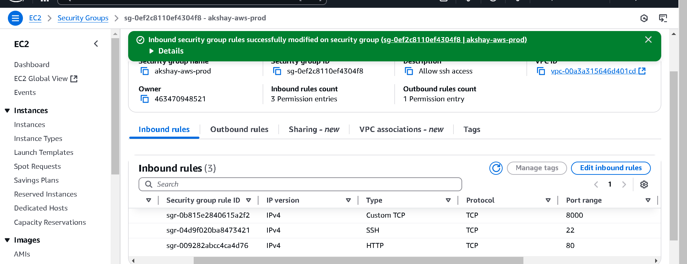

AWS 2 Tier App Deployment using Private Subnet

 

Objective: To deploy a highly available, scalable, and secure web application on AWS, utilizing private subnets, auto-scaling, and load balancing.

1. VPC and Subnet Configuration
Created a custom VPC with two Availability Zones (AZs).

In each AZ, I created one public subnet and one private subnet.

Set up NAT Gateways—one per AZ—to provide internet access for instances in private subnets.

2. Auto Scaling & EC2 Configuration

Enabled Auto Scaling to dynamically scale EC2 instances based on demand.

Selected the appropriate AMI, instance types, key pairs, and security groups.
  
Configured inbound security group rules:

SSH access on port 22

Application access on TCP port 8000

Created a Launch Template for defining EC2 instance configuration.

Set up an Auto Scaling Group to automatically launch instances based on the Launch Template.

Verified that two EC2 instances were successfully launched across the AZs.

3. Secure Access Using Bastion Host
Deployed a Bastion Host (Jump Server) in the public subnet to securely access EC2 instances in the private subnets.

Transferred the key pair to the Bastion instance for SSH access using the command:

scp -i key.pem key.pem ubuntu@<bastion-public-ip>:/home/ubuntu/
  

4. Application Deployment
Deployed a simple HTML file to one of the private EC2 instances.

Launched a basic Python HTTP server on port 8000:

python3 -m http.server 8000

5. Load Balancer Setup
Created an Application Load Balancer  to distribute traffic across the EC2 instances.

Registered both EC2 instances (from the ASG) as targets

Configured the target group to forward traffic to port 8000.
  
 

Performed health checks to monitor the health of the EC2 instances on port 8000.

Updated the security group to allow HTTP traffic on port 80.
  

Successfully tested that the application was accessible via the Load Balancer URL.

6. Final Testing and Demonstration

Verified that Auto Scaling worked as expected by dynamically adjusting the number of EC2 instances based on load.

Confirmed that the load balancing was functioning, distributing traffic evenly across both instances.

Demonstrated the full deployment, showcasing secure access, auto-scaling, load balancing, and the availability of the web application.
  
